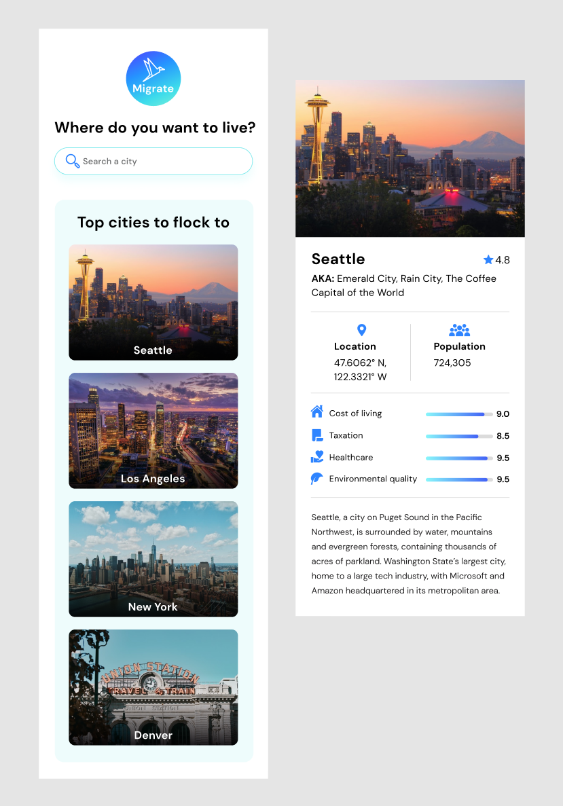
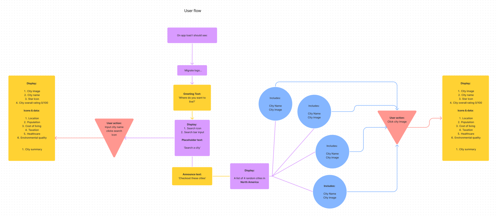
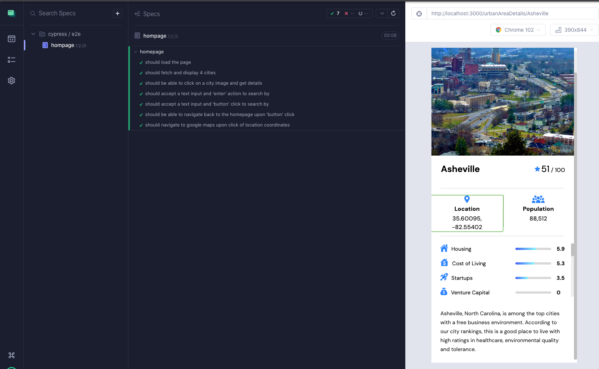
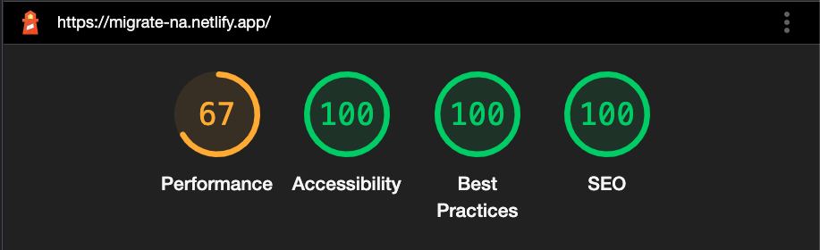

  <!-- Add your project logo if you have any -->
  

 
  <h1 align="center">Migrate</h1>
  

    <!-- Add your tagline or very short intro of your project -->
    Helping those looking to migrate to a new home 
   
  <a href="https://migrate-na.netlify.app/">Migrate</a> 
  

 

   
  
    

 

<figure>
  
  <figcaption>Open location in google maps</figcaption>
</figure>

<!-- You may write notes in your readme this way if you want to, it looks good and also different from other text -->
 

> _**NOTE:** Mobile demos. Desktop version in progress._

<h3 align="center">Migrate provides demographic and quality of life information for major urban areas within North America. </h3>
 

## 🧐About

A few years ago, my wife, dog and I moved from our home state to Colorado. Just couple years after that, we relocated to Washington. This series of moves made me realize what's most important to me when finding a new place live. My main motivators for change were based around the area's job opportunities, weather, and access to outdoor activities. I also assessed the overall quality of life, along with statistical information. All of this research inspired me to make Migrate. Migrate delivers accessible demographic and quality of life information for over 80 urban areas in North America. It provides a bird’s-eye view of urban areas through imagery, highlights, several rated categories and an overall score.
 

## 💡Features

- Search by major metropolitan area, select from a list or choose from randomized suggestions
- Scores for 17 categories, including housing, safety, healthcare and more
- Location coordinates that link to google maps
- Mobile friendly design
 

## ⛏️Built with

- JavaScript
- HTML
- CSS
- React
- React Router v6
- Git VCS
- GitHub Projects
- React Testing Library
- Cypress
- React-Select
- React-Spinners
- Emotion/React
- Figma

## 🏁Getting Started

<a href="https://migrate-na.netlify.app/">See it in action</a>
 

## 🗓Planning, challenges and future improvements

I began planning out this project by reviewing the API documentation provided by Teleport, which led me to brainstorm features. From there, I planned on how to best get the information I needed. The Teleport API has a massive amount of data. Some challenges I faced involved retrieving data embedded deep in a structure that wasn't in a friendly, usable format. I overcame some learning curves as I built this project with several tools I hadn't used before, including React-Select, Emotion/React and Cypress. I also spent time researching React 18 and React Router v6's release changes. Throughout the project, I reviewed and refactored several parts of my code. I often reviewed my prior day's work to determine if I could DRY up the code or implement a better approach to the problem. Overall, I'm satisfied with the outcome and hope to add a desktop friendly version that can take advantage of the wealth of information provided by the Teleport API.
 
 

## 🔧Mock up and planning tools
 

  
  <h2>Migrate comp</h2>
  
  <h2>HTML structure</h2>
  
  <h2>User flow</h2>
  
  <h2>React component structure</h2>
  
  <h2>Cypress testing results</h2>
  
  <h2>Lighthouse scores</h2>
  

## 🎉Acknowledgement

- [Teleport API](https://developers.teleport.org/)
- [React-Select](https://react-select.com/home)
- [React Spinners](https://www.npmjs.com/package/react-spinners)
- [Favicon](https://favicon.io/)
- [Emotion/React](https://emotion.sh/docs/@emotion/react)
- [Flaticon - Saepul Nahwan](https://www.flaticon.com/authors/saepul-nahwan)
- [City Images](https://developers.teleport.org/api/getting_started/) 
- All images belong to the original photographer and are used under creative commons. Attribution information can be located by searching:
https://api.teleport.org/api/urban_areas/slug: **city name** /images/

> _**NOTE:** city names must be lower case. With hyphen if city has 2 names ex. san-antonio_
