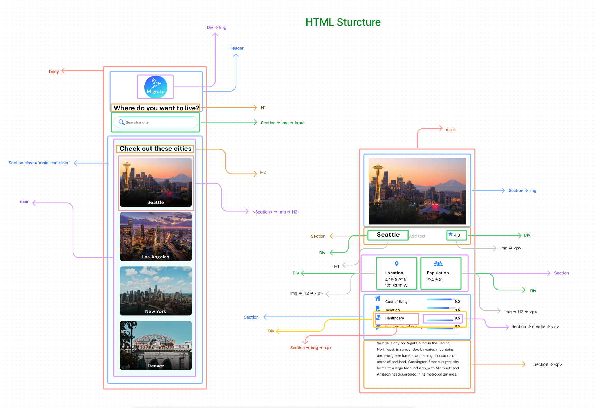
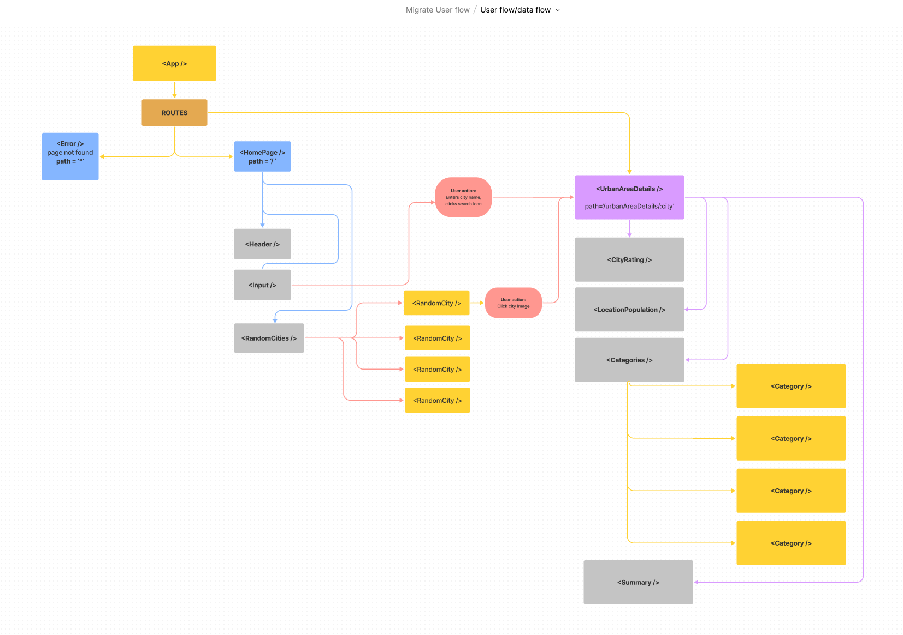

  <!-- Add your project logo if you have any -->
  

 
  <h1 align="center">Migrate</h1>
  

    <!-- Add your tagline or very short intro of your project -->
    Get demographic and quality of life information for major urban areas within North America.
   
  <a href="https://migrate-na.netlify.app/">Migrate</a> 
  

 

    
   
    

 

<!-- Add your project demo gif here -->
  
  
  
  

<!-- You may write notes in your readme this way if you want to, it looks good and also different from other text -->

> _**NOTE:** Mobile demos. Desktop version in progress._

Migrate provides demographic and quality of life information for major urban areas within North America. 

## 🧐About

Several years ago we moved away from my home state and relocated to Colorado. A couple of years after that I moved to Washington state. The weather, work and access to outdoor activities were the main motivators for the change. During this time I also looked into quality of life and statistical information. This inspired me to make Migrate. Migrate allows you access to demographic and quality of life information for 80+ urban areas within North America.  Categories are scored from 1 - 10 and include Housing, Cost of Living, Healthcare in addition to several others. Read about the urban area highlights, see a image and get an overall score. 

## 💡Features

1. Search by major metropolitan area, select from a list or choose a randomly selected city
2. Review the scores for 17 categories including Housing, Safety, Healthcare etc. 
3. Location coordinates link to google maps
4. Excellent Lighthouse scores for accessibility, best practices and SEO
5. Mobile friendly design
6. Unit testing, Integration testing, End to End testing

## ⛏️Built with

- JavaScript
- HTML
- CSS
- React
- React Router v6
- Git VCS
- GitHub Projects
- React Testing Library
- Cypress 
- React-Select
- React-Spinners
- Emotion/React
- Figma

## 🏁Getting Started

<a href="https://migrate-na.netlify.app/">See it in action</a> 

## 🗓Planning, challenges and future improvements

I began planning by reviewing the API documentation provided by Teleport. After brainstorming features, I planned on how to best get the necessary information. The Teleport API has a massive amount of data. All of the information I required access to was sometimes embedded deep within the data structure. Some of the data housed in the Teleport API wasn't always in a friendly usable format. I found it challenging to work with at times. Additionally, I built this project with several tools I've never used before including React-Select, Emotion/React and Cypress. I also had to research some changes due to the release of React 18 and React Router v6. Throughout the project I reviewed and refactored several parts of my code. I would often review what I had done the day prior to determine if I could DRY up the code or implement a better approach to the problem. Overall I'm satisfied with the outcome and hope to add a desktop friendly version that can take advantage of the wealth of information provided by the Teleport API. 

## 🔧Mock up and planning tools

  
  
  
  
  
  

## 🎉Acknowledgement

- [Teleport API](https://developers.teleport.org/)
- [React-Select](https://react-select.com/home)
- [React Spinners](https://www.npmjs.com/package/react-spinners)
- [Favicon](https://favicon.io/)
- [Emotion/React](https://emotion.sh/docs/@emotion/react)
- [City Images](https://developers.teleport.org/api/getting_started/) All images belong to the original photographer and are used under creative commons. Attribution information can be located by searching https://api.teleport.org/api/urban_areas/slug: **city name here all lower case, with hyphen if city has 2 names ex. san-antonio** /images/
- ]
- [Flaticon - Saepul Nahwan](https://www.flaticon.com/authors/saepul-nahwan) 
